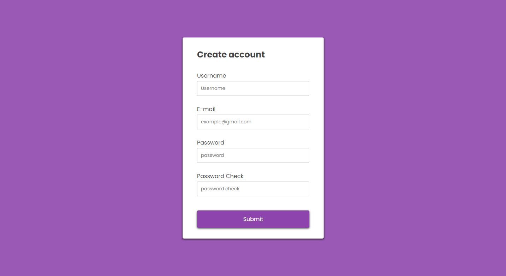
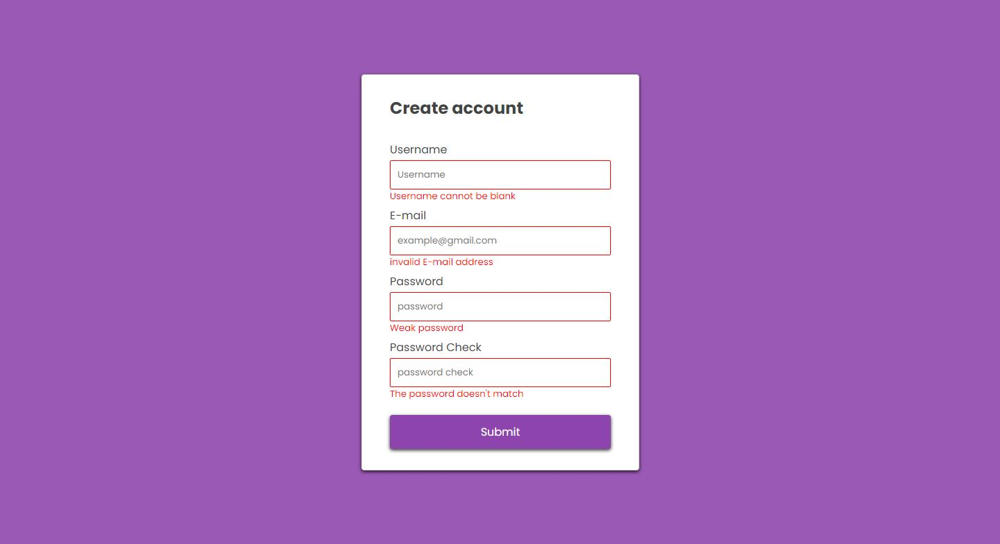

# Form validation

<h1 align="center" >
 

---

</h1>

## :mag: About
a simple form validation, I created this form to study how we can add classes and styles dynamically.

---

 
## :rocket: Technologies used:

	
	
	
	

 **Victor lira dev**
